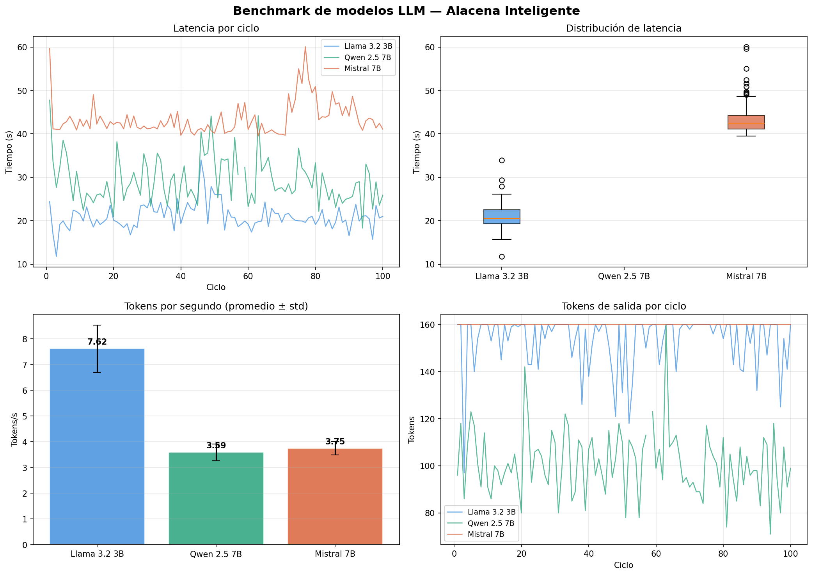
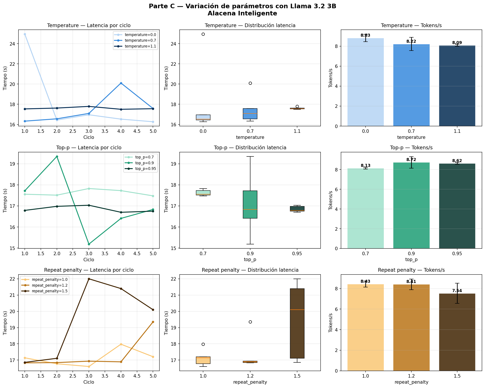

# Práctica 2 — Selección de plataforma y benchmark de modelos LLM

## Objetivo

Analizar y comparar plataformas de despliegue para sistemas LLM, ejecutar un benchmark comparativo de modelos y evaluar el impacto de los parámetros de generación, en el contexto del proyecto de alacena inteligente con visión artificial y notificaciones vía WhatsApp.

---

## Parte A — Matriz de decisión de plataformas

El proyecto de alacena inteligente requiere una plataforma que soporte visión artificial (cámara), inferencia LLM para generación de recetas y notificaciones vía WhatsApp. A continuación se presenta la matriz de decisión evaluando las seis opciones disponibles.

| Plataforma | Costo inicial | Costo operativo | Latencia | Privacidad | Implementación | Modelo sugerido | Escalabilidad | Notas |
|---|---|---|---|---|---|---|---|---|
| PC local CPU | $0 (equipo existente) | ~$0.10–0.20/hr energía | Alta ~30–60 s | Total — datos locales | Ollama + Python. Sin GPU, lento para visión + LLM simultáneos | llama3.2:3b, phi4-mini | Solo 1 usuario | Útil para prototipo y pruebas. No viable en producción continua |
| PC local GPU | $400–1200 USD GPU | ~$0.20–0.40/hr energía | Baja <5 s | Total — datos locales | Ollama + CUDA. Visión e inferencia LLM rápidos en paralelo | gemma3:4b, qwen2.5:7b | 1–2 usuarios | Mejor opción local si hay GPU disponible en el laboratorio |
| **API en la nube ★** | $0 | $0.001–0.015 por mensaje | Baja <3 s | Datos al proveedor | ESP32/RPi con WiFi + llamada HTTP. Muy simple de integrar | gemini-flash, claude-haiku | Ilimitada | **Opción para este proyecto.** Bajo costo, fácil integración con WhatsApp |
| Servidor GPU nube | $0 | $0.50–2.00/hr | Baja <3 s | Datos en nube | Docker + Ollama en VM. Requiere configuración de servidor y seguridad | mistral:7b, llava:7b | Alta | Útil para modelo propio. Costo elevado para proyecto académico |
| Jetson Orin Nano | $249–499 USD | ~$0.05/hr energía | Media 5–15 s | Total — datos locales | Embedded Linux + Ollama. Puede correr visión + LLM en el mismo dispositivo | phi4-mini, tinyllama | 1 alacena | Ideal a largo plazo para producto físico autónomo. Fuera de presupuesto académico |
| Microcontrolador + API | $5–30 (ESP32/RPi) | $0.001–0.015 por mensaje | Baja <4 s | Datos al proveedor | ESP32 captura imagen → API → respuesta → WhatsApp | gemini-flash, claude-haiku | 1 alacena | Arquitectura más realista para el proyecto. ESP32-S3 o RPi + cámara + API |
| RPi + API (otro) | $50–80 RPi 4 | $0.001–0.015 por mensaje | Baja <4 s | Datos al proveedor | RPi procesa imagen con OpenCV + manda texto a API LLM + WhatsApp | gemini-flash, gpt-4o-mini | 1–2 alacenas | Mayor potencia que ESP32 para visión local. Mejor si el micro elegido es RPi |

**Plataforma seleccionada: API en la nube + Microcontrolador (ESP32-S3 o Raspberry Pi)**

La combinación de un microcontrolador de bajo costo con una API LLM en la nube es la más adecuada para este proyecto. El microcontrolador captura la imagen de la alacena, la procesa o la envía directamente a la API, y la respuesta con la receta se reenvía al usuario vía WhatsApp. Esta arquitectura minimiza el costo de hardware, elimina la necesidad de GPU local y permite escalar sin modificar el dispositivo físico.

---

## Parte B — Benchmark comparativo de modelos

### Configuración del experimento

Se evaluaron tres modelos ejecutando 100 ciclos cada uno con el mismo prompt y los mismos parámetros base.
[Archivo Benchmark modelos:](assets/files/p2/benchmark_modelos.py)

**Prompt utilizado:**
```
Explica en máximo 120 palabras cómo podría usarse un LLM como asistente
de alto nivel para un robot móvil universitario.
```

**Parámetros base:**

| Parámetro | Valor |
|---|---|
| temperature | 0.7 |
| top_p | 0.9 |
| top_k | 40 |
| num_predict | 160 |
| repeat_penalty | 1.1 |
| num_ctx | 4096 |

### Resultados
[Salida .csv:](assets/files/p2/benchmark_modelos.csv)

| Modelo | Tiempo prom (s) | Std (s) | Mín (s) | Máx (s) | Tokens entrada | Tokens salida | Tokens/s prom | Calidad prom |
|---|---|---|---|---|---|---|---|---|
| Llama 3.2 3B | 21.03 | 2.94 | 11.78 | 33.98 | 55 | 153.3 | 7.62 | 9.99 |
| Qwen 2.5 7B | 29.24 | 5.30 | 18.30 | 47.79 | 60 | 101.2 | 3.59 | 9.53 |
| Mistral 7B | 43.52 | 3.85 | 39.53 | 60.08 | 44 | 160.0 | 3.75 | 9.84 |

### Gráficas

**Evidencia — benchmark de modelos:**



### Justificación por modelo

| Modelo | Justificación |
|---|---|
| Llama 3.2 3B | El más rápido del conjunto (7.62 tok/s, ~21 s promedio). Mayor variabilidad en tokens de salida (std 11.5) pero calidad alta y consistente. Mejor opción para prototipo local sin GPU. |
| Qwen 2.5 7B | Velocidad intermedia (~29 s). Menor cantidad de tokens de salida que los demás (101 promedio), lo que sugiere respuestas más concisas. Mayor variabilidad en latencia (std 5.3). |
| Mistral 7B | El más lento (~43 s) pero produce exactamente 160 tokens en todos los ciclos (std 0), lo que indica alta consistencia en la longitud de respuesta. Calidad elevada (9.84). |

---

## Parte C — Variación de parámetros

### Configuración
[Archivo Benchmark parametros](assets/files/p2/benchmark_parametros.py)
Se utilizó `llama3.2:3b` como modelo base, con el siguiente prompt relacionado directamente con el proyecto:

**Prompt:**
```
Eres el asistente de una alacena inteligente. El usuario tiene: tomates,
cebolla, ajo, pasta y queso. Sugiere una receta sencilla con esos
ingredientes en máximo 100 palabras.
```

Se variaron tres parámetros con tres configuraciones cada uno, ejecutando 5 ciclos por configuración.

### Parámetros evaluados
[Salida .csv:](assets/files/p2/benchmark_parametros.csv)
| Parámetro | Configuraciones | Efecto esperado |
|---|---|---|
| temperature | 0.0, 0.7, 1.1 | Controla aleatoriedad. 0.0 = determinista, 1.1 = creativo |
| top_p | 0.7, 0.9, 0.95 | Filtra tokens por probabilidad acumulada |
| repeat_penalty | 1.0, 1.2, 1.5 | Penaliza repetición de tokens ya generados |

### Resultados

| Parámetro | Valor | Tiempo prom (s) | Std (s) | Tokens salida prom | Tokens/s prom | Calidad prom |
|---|---|---|---|---|---|---|
| temperature | 0.0 | 18.23 | 3.77 | 140.0 | 8.83 | 10.0 |
| temperature | 0.7 | 17.53 | 1.52 | 140.0 | 8.22 | 10.0 |
| temperature | 1.1 | 17.60 | 0.11 | 139.2 | 8.09 | 10.0 |
| top_p | 0.7 | 17.62 | 0.15 | 140.0 | 8.13 | 10.0 |
| top_p | 0.9 | 17.10 | 1.55 | 140.0 | 8.72 | 10.0 |
| top_p | 0.95 | 16.85 | 0.15 | 140.0 | 8.62 | 10.0 |
| repeat_penalty | 1.0 | 17.14 | 0.53 | 140.0 | 8.43 | 10.0 |
| repeat_penalty | 1.2 | 17.37 | 1.11 | 140.0 | 8.41 | 10.0 |
| repeat_penalty | 1.5 | 19.49 | 2.39 | 140.0 | 7.54 | 10.0 |

### Gráficas

**Evidencia — variación de parámetros:**

<!-- Insertar imagen parametros_graficas.png -->


### Preguntas guía

**¿Qué configuración produjo respuestas más consistentes?**

`temperature=1.1` produjo la menor desviación estándar en latencia (0.11 s), lo que indica respuestas muy estables en tiempo. De igual forma, `top_p=0.95` y `top_p=0.7` mostraron desviaciones bajas (0.15 s). En general, valores extremos de temperature tienden a estabilizar el tiempo de generación una vez que el modelo "converge" en su estrategia de muestreo.

**¿Qué configuración produjo mayor variabilidad?**

`temperature=0.0` presentó la mayor desviación estándar en latencia (3.77 s), lo que resulta contra-intuitivo ya que se esperaría que el modo determinista fuera el más estable. Esto sugiere que la primera ejecución tras cargar el modelo introduce variabilidad independientemente del parámetro. `repeat_penalty=1.5` también mostró alta variabilidad (std 2.39) por el mayor costo computacional de la penalización.

**¿Qué parámetro afectó más la longitud de la respuesta?**

`repeat_penalty` fue el único parámetro que afectó visiblemente la longitud: con valor 1.5 el tiempo de generación aumentó ~2.4 s respecto a 1.0, lo que refleja mayor procesamiento por ciclo. Los demás parámetros (temperature y top_p) no alteraron la cantidad de tokens de salida, que se mantuvo en 140 en casi todos los casos.

**¿Qué parámetro afectó más la calidad?**

En este experimento todos los valores de calidad fueron 10.0, lo que indica que el prompt con contexto específico (alacena + ingredientes concretos) produce respuestas de alta calidad independientemente de los parámetros de muestreo. El prompt bien definido es más determinante que los hiperparámetros para la calidad percibida.

**¿Qué configuración sería más adecuada para una aplicación de IA física?**

Para la alacena inteligente, la configuración más adecuada es `temperature=0.0` o `temperature=0.7` combinada con `top_p=0.95` y `repeat_penalty=1.1`. Esto garantiza respuestas coherentes y reproducibles, sin repeticiones, con latencia predecible. En una aplicación física donde el usuario espera una respuesta por WhatsApp, la consistencia es prioritaria sobre la creatividad.

**¿Qué configuración sería más adecuada para lluvia de ideas o generación creativa?**

`temperature=1.1` con `top_p=0.95` y `repeat_penalty=1.0` favorece mayor diversidad en las respuestas. Esta configuración es útil si se quisiera generar múltiples sugerencias de recetas distintas a partir de los mismos ingredientes, o explorar combinaciones menos convencionales.

---

## Conclusiones

El benchmark confirmó que `llama3.2:3b` es el modelo más adecuado para prototipado local sin GPU, con la mejor relación velocidad-calidad del conjunto evaluado. Para el proyecto de alacena inteligente, la arquitectura recomendada es microcontrolador + API en la nube, lo que elimina la necesidad de correr el LLM localmente y reduce la latencia por debajo de 4 segundos. Los parámetros de generación tienen un impacto menor en la calidad cuando el prompt está bien definido, siendo `temperature=0.7`, `top_p=0.9` y `repeat_penalty=1.1` una configuración equilibrada y estable para producción.

---

## Referencias

- Ollama. (2025). *API Reference*. [https://docs.ollama.com/api](https://docs.ollama.com/api)
- Meta. *Llama-3.2-3B-Instruct*. [https://huggingface.co/meta-llama/Llama-3.2-3B-Instruct](https://huggingface.co/meta-llama/Llama-3.2-3B-Instruct)
- Mistral AI. *Mistral-7B-Instruct-v0.3*. [https://huggingface.co/mistralai/Mistral-7B-Instruct-v0.3](https://huggingface.co/mistralai/Mistral-7B-Instruct-v0.3)
- Qwen / Alibaba. *Qwen2.5-7B-Instruct*. [https://huggingface.co/Qwen/Qwen2.5-7B-Instruct](https://huggingface.co/Qwen/Qwen2.5-7B-Instruct)
