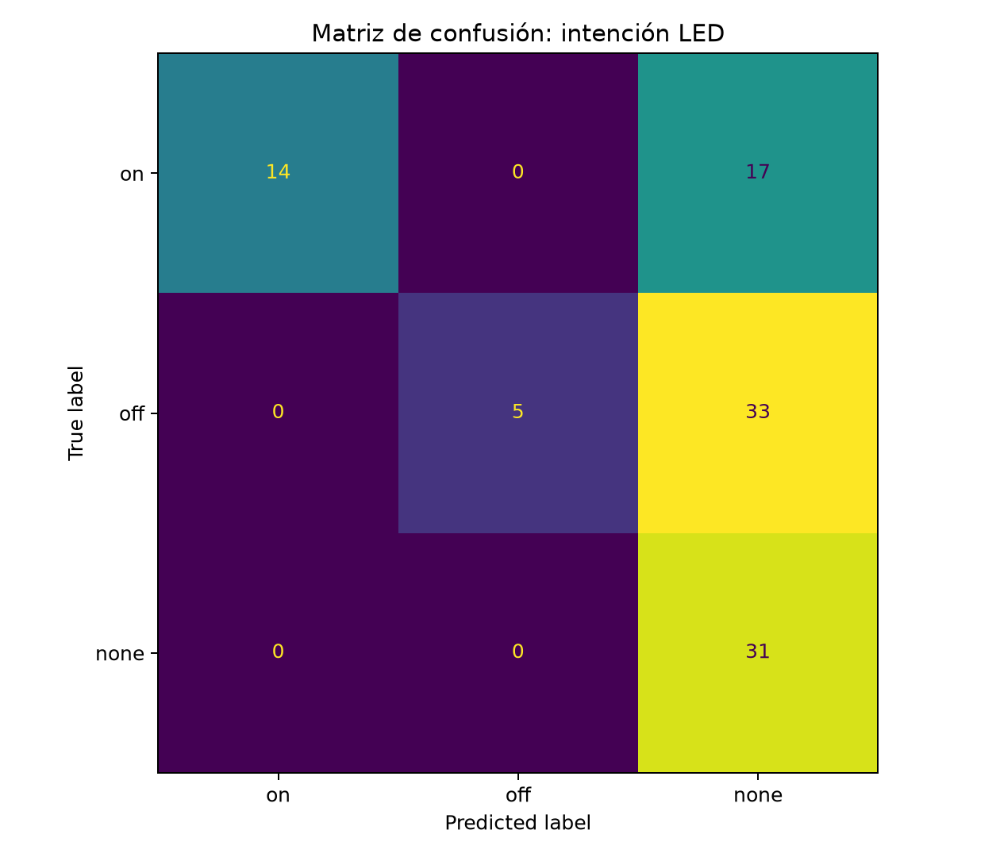
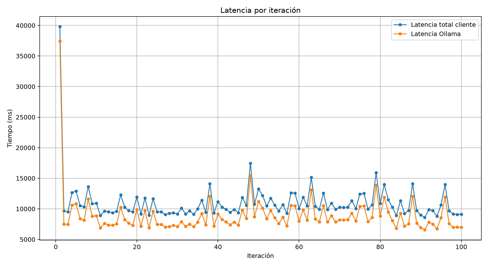
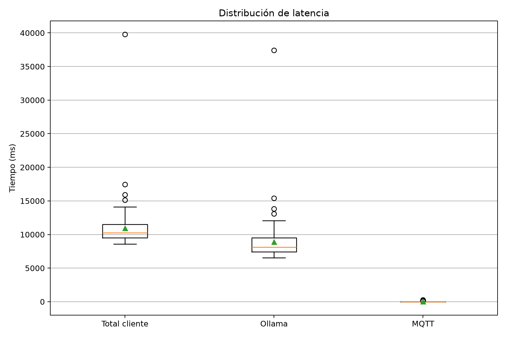
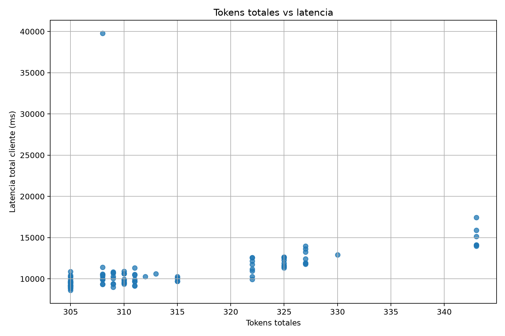
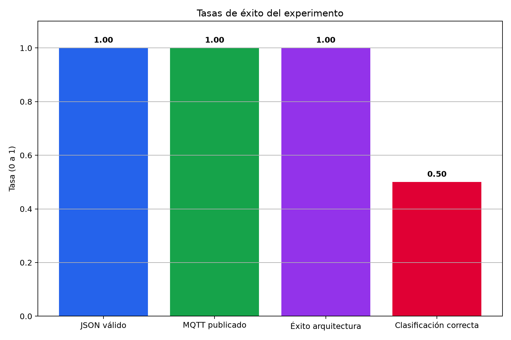

---
layout: default
title: Práctica 6 — Práctica 6: Evaluación arquitectura LLM + MQTT
nav_order: 8
---

# Práctica 6 — Práctica 6: Evaluación arquitectura LLM + MQTT

## 1. Objetivo

Diseñar, implementar y evaluar una arquitectura de agente LLM que clasifique la intención de comandos en lenguaje natural y controle un LED físico mediante MQTT. Se realizaron 100 pruebas cíclicas automatizadas para medir accuracy, latencia, validez del esquema JSON y tasa de publicación MQTT.

---

## 2. Arquitectura del sistema

```
Usuario (lenguaje natural)
        ↓
Backend FastAPI (led_agent.py)
        ↓
   Ollama local (llama3.2:3b)
   Clasificación → JSON estructurado
   {action: on|off|none, confidence, reason}
        ↓
Broker MQTT (mqtt.mecatronica-ibero.mx:1883)
   Tópico: public/llm-led/cmd
        ↓
   ESP32 / suscriptor MQTT
```

El LLM actúa como clasificador de intención: recibe un prompt en lenguaje natural y devuelve un JSON con la acción a ejecutar. Si la acción es `on` u `off`, el backend publica automáticamente al broker MQTT para controlar el LED físico.

---

## 3. Estructura del proyecto

```
ApiAlacena/backend/
├── led_agent.py              # Backend FastAPI práctica 6
├── eval_100.py               # Script de 100 pruebas cíclicas
├── analizar_resultados.py    # Análisis + gráficas
├── requirements_extra.txt    # Dependencias adicionales
├── resultados_llm_led_raw.csv
├── instrumento_supervision_llm_led.xlsx
├── resumen_metricas.csv
├── classification_report.csv
└── graficas_resultados/
    ├── confusion_matrix.png
    ├── latency_by_trial.png
    ├── latency_boxplot.png
    ├── tokens_vs_latency.png
    └── success_rates.png
```

---

## 4. Configuración del experimento

| Parámetro | Valor |
|-----------|-------|
| Modelo LLM | `llama3.2:3b` (Ollama local, CPU) |
| Temperature | 0.0 (determinista) |
| Top-p | 0.9 |
| Max tokens salida | 120 |
| Contexto | 2048 tokens |
| Broker MQTT | `mqtt.mecatronica-ibero.mx:1883` |
| Tópico MQTT | `public/llm-led/cmd` |
| Número de pruebas | 100 |
| Semilla aleatoria | 42 |

### Dataset de prueba

| Clase | Ejemplos de prompts | Cantidad en dataset |
|-------|--------------------|--------------------|
| `on` | "enciende el led", "prende el led", "activa la luz" | 6 prompts |
| `off` | "apaga el led", "desactiva el led", "quita la luz" | 6 prompts |
| `none` | "qué es MQTT", "no enciendas el led", "mañana enciende" | 8 prompts |

---

## 5. Resultados del experimento

### 5.1 Métricas globales

| Métrica | Valor |
|---------|-------|
| Pruebas totales | 100 |
| Accuracy | 0.50 |
| Precision (macro) | 0.79 |
| Recall (macro) | 0.53 |
| F1-score (macro) | 0.47 |
| JSON validity rate | **1.00** |
| MQTT publish rate | **1.00** |
| Architecture success rate | **1.00** |
| Costo estimado (USD) | $0.00 (modelo local) |

### 5.2 Reporte de clasificación por clase

| Clase | Precision | Recall | F1-score | Support |
|-------|-----------|--------|----------|---------|
| `none` | 0.38 | 1.00 | 0.55 | 31 |
| `off` | 1.00 | 0.13 | 0.23 | 38 |
| `on` | 1.00 | 0.45 | 0.62 | 31 |
| **macro avg** | **0.79** | **0.53** | **0.47** | **100** |

### 5.3 Métricas de latencia

| Métrica | Valor |
|---------|-------|
| Latencia media (ms) | 10,968 |
| Latencia P50 (ms) | 10,238 |
| Latencia P95 (ms) | 14,096 |
| Latencia P99 (ms) | 17,681 |
| Tokens entrada (media) | 276 |
| Tokens salida (media) | 38 |
| Tokens totales (media) | 314 |

---

## 6. Gráficas de resultados

### 6.1 Matriz de confusión


La matriz revela el patrón de error más importante del experimento: el modelo clasificó correctamente el 100% de los prompts `none` pero colapsó casi todas las predicciones de `off` hacia `none`. De 38 casos `off`, solo 5 se clasificaron correctamente (recall = 0.13). Los prompts `on` tuvieron un desempeño intermedio: 14 correctos de 31 (recall = 0.45).

---

### 6.2 Latencia por iteración


La iteración 1 tuvo un pico de ~40,000 ms causado por la carga inicial del modelo en memoria (cold start de Ollama). A partir de la iteración 2, la latencia se estabilizó entre 7,000 y 17,000 ms. La brecha entre la línea azul (latencia total cliente) y la naranja (latencia Ollama) representa el overhead del backend y la publicación MQTT, que es mínimo.

---

### 6.3 Distribución de latencia


El boxplot confirma que la mayor parte del tiempo de respuesta lo consume Ollama (~8,500 ms mediana). La latencia MQTT es prácticamente instantánea (< 200 ms en todos los casos), lo que valida que el broker de la Ibero responde con rapidez. Los outliers en Total cliente y Ollama corresponden al cold start de la primera iteración.

---

### 6.4 Tokens totales vs latencia


Existe una correlación positiva entre el número de tokens generados y la latencia: prompts que generaron más tokens de salida (~343 tokens) tardaron más (~15,000 ms). Los prompts con menos tokens (~305) tuvieron latencias más bajas (~9,000–10,000 ms). Esto es consistente con el comportamiento esperado de un modelo autoregresivo corriendo en CPU.

---

### 6.5 Tasas de éxito del experimento


La arquitectura fue robusta a nivel de infraestructura: JSON válido, MQTT publicado y éxito de arquitectura alcanzaron 1.00 en las 100 pruebas. El único indicador bajo fue la clasificación correcta (0.50), que corresponde al desempeño semántico del LLM, no a fallos de la pipeline.

---

## 7. Análisis de resultados

### ¿Por qué el accuracy fue 0.50?

El modelo `llama3.2:3b` tuvo un sesgo claro hacia la clase `none`: cuando no estaba seguro de si encender o apagar, defaulteaba a "ninguna acción". Esto explica el recall perfecto de `none` (1.00) pero el muy bajo recall de `off` (0.13). El modelo parece interpretar la mayoría de comandos de apagado como ambiguos.

La clase `on` tuvo mejor desempeño (recall 0.45) posiblemente porque verbos como "enciende" o "prende" tienen menos ambigüedad semántica que "apaga" o "desactiva" en el contexto del system prompt dado.

### ¿La arquitectura funcionó?

Sí completamente. La separación entre **éxito de arquitectura (1.00)** y **accuracy de clasificación (0.50)** es el hallazgo más importante del experimento. El sistema LLM+MQTT+FastAPI funcionó sin errores en las 100 pruebas: siempre generó JSON válido, siempre publicó al broker MQTT cuando correspondía. El problema es semántico, no de infraestructura.

### ¿Qué mejoraría el accuracy?

Las acciones más directas serían:

1. **Mejorar el system prompt**: agregar más ejemplos de `off` explícitos (few-shot prompting)
2. **Usar un modelo más grande**: llama3.2:3b es un modelo de 3B parámetros corriendo en CPU; modelos de 7B o superiores clasifican mejor en tareas de intención
3. **Ajustar temperatura**: se usó 0.0 (determinista); un valor ligeramente mayor podría diversificar las predicciones de `off`
4. **Aumentar el dataset**: el dataset tiene solo 20 prompts únicos; con más variedad el LLM tendría menos ambigüedad

### ¿Cuál fue el cuello de botella de latencia?

Ollama en CPU sin GPU dedicada. La mediana de latencia de Ollama fue ~8,500 ms, lo que representó aproximadamente el 80% del tiempo total de respuesta. Para una aplicación en tiempo real de control de actuadores, esta latencia es demasiado alta. Con GPU o usando una API externa (Groq), la latencia bajaría a <1,000 ms.

### ¿Qué implica el costo $0.00?

Al correr el modelo localmente con Ollama, el costo por token es cero en términos monetarios. El costo real es el tiempo de inferencia (~11 segundos por prueba) y el hardware necesario. Para las 100 pruebas se usaron ~31,423 tokens totales que en una API como Groq costarían menos de $0.01 USD pero con latencias de ~300 ms en lugar de ~10,000 ms.

---

## 8. Instrumento de supervisión humana

Se generó automáticamente el archivo `instrumento_supervision_llm_led.xlsx` con las 100 pruebas y columnas para revisión manual:

| Columna | Descripción |
|---------|-------------|
| `accion_correcta_supervisor` | El supervisor puede corregir la etiqueta (on/off/none) |
| `evaluacion_supervisor` | correcto / parcial / incorrecto / no evaluado |
| `calidad_1_5` | Calificación del 1 al 5 |
| `observaciones_supervisor` | Campo libre de comentarios |

Este instrumento permite la evaluación humana en el ciclo de mejora del agente LLM.

---

## 9. Conclusiones

Esta práctica demostró que es posible construir una pipeline funcional LLM → JSON → MQTT → actuador físico con herramientas open source (FastAPI, Ollama, paho-mqtt) sin costo de API. La arquitectura fue robusta al 100% en infraestructura, pero el clasificador semántico con `llama3.2:3b` en CPU mostró limitaciones claras para la clase `off`.

El experimento ilustra una distinción importante en sistemas de IA aplicada: **que la infraestructura funcione no garantiza que la inteligencia sea correcta**. Evaluar ambas dimensiones por separado — como hace este instrumento — es fundamental para el diseño responsable de agentes LLM en sistemas físicos como robótica, domótica o IoT industrial.

---

## 10. Referencias

1. Giron, H. (2026). *Evaluación de arquitecturas LLM + MQTT*. https://hubergiron.github.io/llm-ollama/evaluacion-arquitecturas-llm-mqtt/
2. Ollama. (s. f.). *API Documentation*. https://docs.ollama.com
3. FastAPI. (s. f.). *FastAPI Documentation*. https://fastapi.tiangolo.com
4. Eclipse Foundation. (s. f.). *Paho MQTT Python Client*. https://eclipse.dev/paho/index.php?page=clients/python/index.php
5. Scikit-learn. (s. f.). *Classification metrics*. https://scikit-learn.org/stable/modules/model_evaluation.html
6. MQTT.org. (s. f.). *MQTT: The Standard for IoT Messaging*. https://mqtt.org
